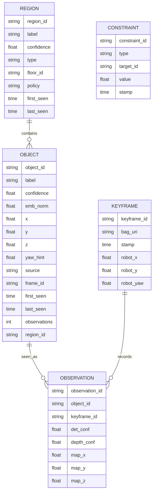

# LyraGraph

## Executive summary

LyraGraph should be built as a **lightweight, ROS 2/Nav2-native semantic layer on top of your existing geometry-first navigation stack**, not as a replacement for it. The strongest practical design is a **hybrid object–region semantic graph**: object nodes for things like sofa, chair, fridge, door, dock; region nodes for room/zone semantics like kitchen, hallway, restricted area, slow zone. This is well aligned with how Nav2 already works: layered costmaps, filters, actions, planners, and custom plugins. Nav2 today already supports plugin-based costmap layers, keepout/speed filters, vector-object masks, and even a semantic-segmentation tutorial that publishes class masks into the costmap; what it does **not** provide by default is robust open-vocabulary, language-grounded semantic understanding. citeturn31search3turn31search5turn6view0turn33search0turn33search2turn33search4

The idea itself is **not novel at the paper-title level**. Closely related systems already exist: **VLMaps** fuse visual-language features into a spatial map; **HOV-SG** builds hierarchical open-vocabulary 3D scene graphs for language-grounded navigation; **ConceptGraphs** builds persistent object-centric scene graphs from RGB-D; **VLFM** uses frontier exploration plus vision-language grounding; **OneMap** focuses on reusable open-vocabulary maps for multi-object navigation; and **Open Scene Graphs** propose topo-semantic memory for open-world object-goal navigation. The gap you can credibly target is different: **a commodity-GPU, ROS 2/Nav2-native, reproducible, hybrid object–region graph with usable real-robot deployment and clean Nav2 integration**. citeturn9search2turn9search1turn6view2turn10search0turn6view3turn34view0turn35view0turn35view4

For an RTX 3070 developer, the right strategy is **offline-heavy graph building, online-lightweight execution**. Use your robot’s normal mapping/localisation pipeline to produce `/map` and TF, record RGB-D plus poses with rosbag2 or a custom synchronised logger, sample only keyframes, then run open-vocabulary perception and multi-view fusion offline or at low rate. Online, keep the graph query, reachable-pose generation, and Nav2 control loop lightweight. A typical desktop RTX 3070 has **8 GB GDDR6**, while a datacentre **T4** has **16 GB**; that makes the 3070 good for MVP inference and demos, but not for simultaneously running large generative VLMs, heavy detectors, simulators, and segmentation stacks. citeturn26search2turn25search1

**Bottom line:** build LyraGraph as an engineering-first system with a research path.  
**MVP:** offline object graph + reachable-pose grounding + Nav2 goal dispatch.  
**V2:** add region polygons + keepout/speed/vector-object integration.  
**Research demo:** add confidence-aware multi-view fusion, language-conditioned semantic costs, and a quantitative evaluation in simulation and on a real robot. This is a **strong portfolio project** and a **credible workshop paper** if executed cleanly; a main-conference paper would need stronger algorithmic novelty and broader experiments.

**Assumptions marked as unspecified:** robot platform, exact camera/LiDAR stack, dataset size, and operating distro are unspecified. I assume **ROS 2 Humble / Ubuntu 22.04**, a **differential-drive indoor robot**, **2D LiDAR + RGB-D camera**, and an **RTX 3070 8 GB** machine because that is the most common fit for your existing bringup context. citeturn26search2

## Literature and positioning

The most useful way to position LyraGraph is not against “semantic navigation” in general, but against the **map representation** each system chooses.

| Work | Core representation | What it gives you | Official open-source status | ROS2 compatibility note | Relevance to LyraGraph |
|---|---|---|---|---|---|
| VLMaps | Dense visual-language feature map fused into geometry | Natural-language landmark indexing and spatial goal grounding | Official repo available | Not ROS2-native in the official repo; notebook/Python workflow and its own navigation stack | Strong conceptual ancestor for map-grounded language queries |
| HOV-SG | Hierarchical open-vocabulary 3D scene graph | Floor/region/object hierarchy for language-grounded robot navigation | Official repo available | No ROS/ROS2 packaging evident in official repo; Habitat/posed RGB-D pipeline | Closest research match for object+region hierarchy |
| ConceptGraphs | Persistent object-centric concept graph from RGB-D | Object memory, semantic fusion, optional scene-graph generation | Official repo available | Core repo is not ROS/ROS2; a separate Jackal experiment repo exists for ROS Noetic, not ROS2 | Closest practical match for object fusion and map memory |
| VLFM | Frontier-based semantic search + language value map | Zero-shot object search in unknown scenes | Official repo available | Python/Habitat/Spot extras; not ROS2-native in official repo | Good baseline for search/object-goal navigation |
| OneMap | Reusable open-vocabulary feature map with uncertainty-aware updates | Repeated object search and multi-object navigation | Official repo available | Docker/Habitat workflow; no ROS2 packaging evident in official repo | Strong recent baseline for reusable semantic memory |
| Open Scene Graphs / OpenSearch | Topo-semantic open scene graph memory | LLM-friendly object-goal reasoning over open-set scenes | Paper available in surveyed sources | Public ROS2 package not identified in the sources surveyed | Useful framing for semantic memory and reasoning |

The source evidence for that table is strong on the representation side. VLMaps explicitly fuses pretrained visual-language features into a geometric reconstruction and uses language indexing in the map. HOV-SG explicitly targets hierarchical open-vocabulary 3D scene graphs for language-grounded navigation and its official repo is a Python/Habitat-style pipeline using posed RGB-D, OpenCLIP, and SAM. ConceptGraphs’ official repo uses ultralytics, Grounded-SAM, gradslam, and LLaVA for scene-graph generation; the main repo is not ROS-based, while a separate Jackal code release is a rough **ROS Noetic** stack built around `move_base`, Open3D SLAM, and custom goal topics. VLFM and OneMap are both open-source, but their official repos are also primarily Python/simulator workflows rather than ROS2/Nav2 packages. citeturn9search2turn9search1turn6view2turn8view0turn6view3turn8view2turn7view0turn34view0turn35view0turn35view3

The practical conclusion is blunt: **the research idea exists; the clean ROS 2/Nav2-native delivery does not appear to be the centrepiece of the official open-source implementations surveyed**. That is good for LyraGraph as a system project, but it also means you should not claim “semantic graph for language navigation” as the novelty. Your defensible claim is narrower and stronger: **a lightweight, reproducible ROS 2/Nav2 integration that makes object–region semantic memory operational on commodity hardware**. citeturn8view0turn8view2turn7view0turn34view0turn35view1

Two additional points matter for scoping. First, HOV-SG is powerful but heavy: it expects posed RGB-D sequences and its repo even warns that full ground-truth compilation can require very large RAM for dataset generation. Second, ConceptGraphs is also heavy in dependencies and uses Grounded-SAM and LLaVA-style tooling. Those systems are better treated as **research references**, not as your direct implementation template on an RTX 3070. citeturn8view3turn6view3

## System architecture and data model

The cleanest LyraGraph architecture is a **two-plane system**:

1. **Geometric navigation plane**: SLAM/localisation, TF, costmaps, controllers, obstacle avoidance, recovery.  
2. **Semantic memory plane**: keyframes, object/region fusion, graph storage, language grounding, semantic constraints.

That separation matches Nav2’s architecture and will keep debugging sane. The official Nav2 stack already exposes action servers for `NavigateToPose`, `NavigateThroughPoses`, and path-computation APIs, plus a Python costmap API through the commander interface. rosbag2 can record synchronised topics, and `sensor_msgs/CameraInfo` carries the camera model needed for projection. citeturn31search0turn31search6turn32search1turn31search8turn27search3turn27search6

```mermaid
flowchart LR
    A[LiDAR /scan] --> B[SLAM / localisation]
    C[RGB image] --> D[Keyframe logger]
    E[Depth image] --> D
    F[/tf] --> D
    B --> G[/map + robot pose]

    D --> H[Perception batch/offline builder]
    H --> I[Object detections]
    H --> J[Region proposals / labels]
    H --> K[3D grounding + multi-view fusion]

    K --> L[(LyraGraph store)]
    L --> M[Language grounding node]
    M --> N[Goal resolver]
    G --> N
    N --> O[Reachable pose search]
    O --> P[Safety validator]
    P --> Q[Nav2 actions]
    Q --> R[Planner / controller / recoveries]
```

A ROS 2-native breakdown that stays practical is this:

| Node / package | Role | Main I/O |
|---|---|---|
| `lyragraph_keyframe_logger` | synchronise RGB, depth, camera info, TF, robot pose; write keyframes or rosbag2 index | subscribes `/camera/*`, `/tf`, `/odom` or AMCL pose; writes bag/files |
| `lyragraph_perception` | detector, masker, embedding extractor, optional VLM captioner | reads keyframes; publishes `SemanticDetections` |
| `lyragraph_fusion` | back-project masks/boxes, transform to map frame, associate and merge objects | reads detections + depth + TF; updates graph |
| `lyragraph_regions` | manual polygon import and/or automatic room segmentation + labels | reads map/keyframes; updates region nodes |
| `lyragraph_store` | persistent graph DB, JSON export/import, query API | service/action/topic interface |
| `lyragraph_grounder` | turn text command into structured query | input text; outputs graph query / constraints |
| `lyragraph_nav_bridge` | compute reachable pose(s), validate path, send Nav2 action | uses graph + costmap + planner actions |
| `lyragraph_semantic_layer` | optional custom costmap layer for dynamic semantic costs | subscribes graph constraints; updates costmap |
| `lyragraph_viz` | RViz markers, annotated map overlays, graph introspection | publishes markers/images |

A minimal graph schema should track **identity, pose, provenance, confidence, and freshness**. Do not make the first version more complicated than this.



A corresponding JSON shape can be simple and versioned:

```json
{
  "schema_version": "0.1",
  "objects": [
    {
      "object_id": "obj_sofa_01",
      "label": "sofa",
      "confidence": 0.91,
      "mean_pose_map": [2.42, 1.09, 0.00],
      "reachable_pose_map": [1.98, 0.97, 1.54],
      "embedding_id": "clip_00123",
      "region_id": "region_living_room",
      "first_seen": "2026-05-02T10:00:00Z",
      "last_seen": "2026-05-02T10:04:13Z",
      "observations": 8
    }
  ],
  "regions": [
    {
      "region_id": "region_kitchen",
      "label": "kitchen",
      "type": "room",
      "polygon_map": [[4.0,2.0],[6.1,2.0],[6.1,4.2],[4.0,4.2]],
      "policy_default": "neutral",
      "confidence": 0.84
    }
  ]
}
```

### Depth-to-map grounding

The geometric core is straightforward. For a pixel `(u, v)` with depth `Z`, and camera intrinsics `(fx, fy, cx, cy)`, back-project into the camera frame:

\[
X = (u - c_x)\frac{Z}{f_x}, \qquad
Y = (v - c_y)\frac{Z}{f_y}, \qquad
Z = d(u,v)
\]

Then transform to map coordinates using TF:

\[
\mathbf{p}_{map} = \mathbf{T}^{map}_{camera}(t)\,[X, Y, Z, 1]^T
\]

This is exactly why logging `CameraInfo` and using the calibrated projection matrix is non-negotiable. ROS documents `CameraInfo` for the projection model and explicitly points developers toward `image_geometry` for these operations. citeturn27search6

### Keyframe logging and synchronisation

Do **not** process raw 30 FPS end-to-end unless you are doing a short demo. Record all streams if you want, but process only keyframes. A good practical policy is:

- minimum time delta `>= 0.5 s`
- translation delta `>= 0.20–0.30 m`
- yaw delta `>= 10–15 deg`
- reject blurred frames
- reject depth frames with too many invalid pixels
- optionally trigger on semantic novelty using embedding delta

At 30 FPS, a 30-minute exploration run has about **54,000 frames**. Sampling at **1–2 Hz** or by motion thresholds typically brings that down to the low thousands, which is tractable on an RTX 3070.

Use rosbag2 for reproducibility, or a custom writer if you want a lighter index. ROS 2 officially supports topic recording and replay via `ros2 bag`, and also exposes a C++ API if you want recording inside a node. citeturn27search3turn27search5

### Multi-view fusion and identity tracking

For LyraGraph, object identity should be **map-centric**, not track-centric. The association unit is a persistent object node, not a video track. A robust association score for a new detection `i` against an existing node `j` is:

\[
S_{ij} = w_d \exp(-\|\Delta p\|^2/\sigma_d^2) +
         w_e \cos(e_i, e_j) +
         w_l \,\mathbf{1}[label_i = label_j] +
         w_t \exp(-\Delta t/\tau)
\]

where `Δp` is 3D map distance, `e` is the CLIP/OpenCLIP image embedding of the crop or mask, label equality can be soft if you keep synonym sets, and `Δt` helps merge consecutive observations while still allowing re-observation later. Use a Hungarian assignment or greedy matching with a merge threshold. Update each object node with:

- running centroid and covariance
- label histogram
- mean embedding
- observation count
- `last_seen`
- per-source confidence breakdown

For bulky objects with unstable centres, fuse at the **mask point cloud** level first, then compute the node centroid from the fused cloud.

### Region extraction

For regions, you have two good paths.

**MVP path:** draw room/zone polygons manually and store them as YAML/JSON. This is fast, accurate enough for demos, and plays beautifully with Nav2’s existing keepout filters and vector-object workflow. Nav2 already supports vector objects rasterised into costmap masks and keepout/speed filters based on map masks. citeturn33search4turn33search0turn33search2

**V2 path:** automatically segment free space into candidate regions from the occupancy map using connected components plus doorway narrowing; then label each candidate with a small VLM over representative keyframes gathered inside that region. This part is a real research contribution if it works reliably.

### Failure modes

The predictable failure modes are depth/RGB misalignment, TF drift, open-vocabulary false positives, duplicate instances from poor fusion, moved objects, reflective surfaces, and stale semantics. Nav2’s semantic-segmentation tutorial also explicitly warns that aligned colour and depth are important for its costmap plugin. LyraGraph should therefore treat **staleness** as a first-class field and should never assume that an object last seen long ago is still there. citeturn5view7turn6view0

## Implementation plan and compute budget

The most important implementation decision is this:

**Use the 3070 for local development and demos; use occasional T4-class cloud bursts only for offline batch extraction or short training jobs.**

A desktop RTX 3070 gives you 8 GB memory; a datacentre T4 gives you 16 GB. Free notebook services can be useful, but resource availability is not guaranteed. citeturn26search2turn25search1turn24search13

### Recommended model stack

For LyraGraph, a **single-model solution is the wrong choice** on your hardware. Use a **composed perception stack**.

| Model | Best role in LyraGraph | Open-vocab | Practical checkpoint | Likely VRAM on RTX 3070 | Likely latency on RTX 3070 | Verdict |
|---|---|---:|---|---:|---:|---|
| YOLOv8n / YOLOv8s | closed-set baseline detector | No | `yolov8n.pt` / `yolov8s.pt` | ~1–2 GB | ~10–25 ms | Best baseline and sanity check |
| Grounding DINO-T | precise open-vocab detector | Yes | Swin-T OGC | ~3–5 GB | ~80–150 ms | Best offline / low-rate OV detector |
| YOLO-World-S 640 | real-time open-vocab detector | Yes | `YOLO-World-S` | ~2–4 GB | ~15–35 ms | Best online OV detector |
| MobileSAM | box-prompted mask extraction | Promptable | `vit_t` / `mobile_sam.pt` | ~1–2 GB | ~10–25 ms | Best segmentation helper for 3070 |
| SAM 2 small/tiny | better masks / video memory | Promptable | SAM 2.1 small/tiny | ~2–5 GB | ~20–60 ms | Good offline, not necessary for MVP |
| OpenCLIP ViT-B/32 | crop re-ranking, embedding store | Yes | LAION-2B B/32 | ~1 GB | ~5–10 ms | Strong default embedding backbone |
| SegFormer-B0 | terrain / traversability segmentation | Closed-set classes | NVIDIA/HF B0 | ~1.5–2.5 GB | ~20–40 ms | Best if you want semantic costmaps early |
| Qwen2.5-VL-3B-AWQ | offline region naming / graph cleanup / JSON generation | Generative VLM | AWQ 4-bit 3B | ~5–7 GB | ~1–4 s per image-query | Use sparingly; offline only |
| SmolVLM2-2.2B | small multimodal captioner | Generative VLM | 2.2B | ~4–6 GB | ~1–3 s | Viable alternative |
| InternVL2.5-2B | stronger small VLM | Generative VLM | 2B | ~6–8 GB+ | ~1–4 s | Borderline on 8 GB once image tiling kicks in |
| Mask R-CNN R50-FPN | classical instance segmentation baseline | No | Detectron2 model zoo | ~3–5 GB | ~50–100 ms | Good academic baseline, not primary choice |

**Latency and VRAM above are engineering estimates**, not vendor-guaranteed benchmarks. They assume batch size 1, FP16 where possible, moderate input sizes, and no simulator/VLM co-residency.

The source evidence supporting the model choices is strong: Grounding DINO is a standard open-set detector and official implementations/checkpoints exist for Swin-T and Swin-B; YOLO-World is explicitly designed for real-time open-vocabulary detection and provides S/M/L/X families plus model cards; MobileSAM and SAM 2 are official promptable segmentation repos; OpenCLIP provides standard CLIP-compatible backbones; Qwen2.5-VL has a 3B model and official AWQ weights; SmolVLM2 and InternVL2.5 both have official smaller multimodal variants; SegFormer is an efficient semantic segmentation backbone; Detectron2 exposes ready Mask R-CNN checkpoints; and Ultralytics provides current YOLO tooling for the baseline detector. citeturn21search1turn12search2turn12search3turn11academia50turn18view0turn29view4turn11academia51turn14search1turn14search0turn12search6turn21search0turn11search3turn11search4turn20search1turn20search3turn22search0turn22search2turn30search2turn30academia36turn16search2turn16search0

### Pragmatic recommendation by milestone

For the **MVP**, use **YOLOv8n/s + depth projection + closed-set object DB**. It is the fastest way to prove the full plumbing works.

For **V2**, replace detection with **YOLO-World-S** for online open-vocabulary detection, and use **MobileSAM** for masks when needed. Keep **OpenCLIP ViT-B/32** as the persistent embedding backbone.

For the **research demo**, add **Grounding DINO-T** as a slower but more precise offline extractor, and use **Qwen2.5-VL-3B-AWQ** only for low-frequency tasks such as region-name generation, graph summarisation, or ambiguous instruction repair.

### Local versus cloud compute

| Task | Run locally on RTX 3070 | Use T4 cloud burst if needed | Why |
|---|---|---|---|
| ROS 2 bringup, Nav2, RViz, real-robot debug | Yes | No | Tight feedback loop matters more than throughput |
| Gazebo / Ignition simulation + Nav2 | Yes | Optional | Local is easier for iterative debugging |
| MVP closed-set detection and projection | Yes | No | Easily fits 8 GB |
| YOLO-World-S online inference | Yes | No | Practical on 3070 |
| Grounding DINO offline batch over keyframes | Yes, if sampled | Yes, if long runs | Useful when video batches get large |
| MobileSAM masks | Yes | Optional | Fine locally |
| SAM 2 offline polishing | Maybe | Yes | Better with extra memory |
| Small-VLM region naming / JSON cleanup | Yes, one model at a time | Optional | Quantised 2–3B is manageable if isolated |
| Fine-tuning custom detector/segmenter | Rarely | Yes | Training is the least 3070-friendly stage |
| Full dense-map reproductions of heavy baselines | Painful | Yes | Not a good spend of local time |

A good rule is: **local for everything interactive, cloud only for batch jobs**.

### Milestone timeline

| Milestone | Deliverable | Estimated person-days | Main compute |
|---|---|---:|---|
| MVP | object detections projected to map, JSON store, “go to sofa” via Nav2 | 10–14 | Local 3070 |
| V2 | multi-view object fusion, region polygons, manual room labels, better query parser | 8–12 | Local 3070 |
| Demo-ready | RViz markers, sim scene, reproducible launch files, short video | 5–7 | Local 3070 |
| Research demo | open-vocab detector, confidence/staleness logic, region-aware constraints, evaluation scripts | 10–15 | Local + optional T4 |
| Paper-quality | ablations, user study or richer real-robot trials, baseline comparisons | 12–20 | Local + optional T4 |

### Compute budget

| Resource | Assumed capacity | LyraGraph usage |
|---|---|---|
| GPU local | RTX 3070, 8 GB | online detector, local simulation, offline sampled extraction |
| GPU cloud | T4, 16 GB | occasional batch extraction or model evaluation |
| System RAM | 32–64 GB recommended | bags, point clouds, graph building, Gazebo |
| Disk | 200–500 GB comfortable | rosbags, maps, keyframes, checkpoints |
| Offline keyframe load | ~1–3k keyframes per long indoor run | practical batch size for 3070 |
| Online query budget | <500 ms ideal | graph lookup + reachable pose + action dispatch |
| Online perception budget | 1–5 Hz enough | semantic updates do not need 30 FPS |

## Nav2 integration and evaluation

The first Nav2 principle is simple: **do not send the robot to the semantic object centroid**. Send it to a **reachable, collision-free observation pose**. Nav2 gives you precisely the tools you need: a costmap API to inspect costs, `ComputePathToPose` to validate reachability, and `NavigateToPose` / `NavigateThroughPoses` to execute. citeturn31search8turn32search1turn31search0turn31search6

A robust reachable-pose generator should:

1. take the object centroid or region polygon,  
2. sample candidate poses on a ring or along polygon offsets,  
3. reject cells above a cost threshold, cells too close to lethal costs, or cells outside the map,  
4. face the pose toward the target,  
5. call `ComputePathToPose`,  
6. choose the candidate with the best blend of path validity, clearance, and viewing angle.

A minimal scoring function is:

\[
J = \alpha \cdot \text{clearance} - \beta \cdot \text{path\_length}
    + \gamma \cdot \text{view\_score} - \delta \cdot \text{semantic\_penalty}
\]

This makes the planner choice explicit and debuggable.

### Safety validator

Before any semantic goal is dispatched, validate:

- target node exists and is fresh,
- confidence exceeds threshold,
- robot localisation is healthy,
- TF chain to map frame is current,
- candidate goal is inside map,
- path exists,
- optional line-of-sight is unobstructed,
- semantic constraints are not violated,
- for human/person targets, minimum separation is satisfied.

This validator is where semantics become safe instead of merely impressive.

### Semantic costs

For region semantics, **do not start with a custom costmap plugin** unless you need dynamic language-conditioned costs. Nav2 already gives you three excellent mechanisms:

- **Keepout Filter** for “never enter bedroom / restricted zone”,  
- **Speed Filter** for “slow near people / docking area”,  
- **Vector Objects + Keepout** for polygon-first region authoring. citeturn33search0turn33search1turn33search2turn33search3turn33search4

That means your **V2 region semantics can be built almost entirely from existing Nav2 mechanisms**. A custom `lyragraph_semantic_layer` only becomes necessary when the language command itself changes the cost policy at runtime, for example:

- “go to the sofa but avoid the kitchen”
- “prefer the hallway”
- “stay 1.5 m away from people”
- “approach the dock slowly”

Nav2’s own semantic-segmentation tutorial shows the pattern clearly: a segmentation node publishes `/segmentation/mask`, `/segmentation/confidence`, and `/segmentation/label_info`, and a costmap plugin maps classes into cost buckets such as traversable, intermediate, and danger. That is exactly the idiom LyraGraph should follow if you later add a graph-driven semantic layer. citeturn5view7turn6view0

A simple starting configuration is:

```yaml
global_costmap:
  global_costmap:
    ros__parameters:
      plugins: ["static_layer", "obstacle_layer", "inflation_layer"]
      filters: ["keepout_filter"]
      keepout_filter:
        plugin: "nav2_costmap_2d::KeepoutFilter"
        enabled: True
        filter_info_topic: "lyragraph_keepout_info"

controller_server:
  ros__parameters:
    speed_limit_topic: "speed_limit"

local_costmap:
  local_costmap:
    ros__parameters:
      plugins: ["voxel_layer", "inflation_layer"]
      filters: ["speed_filter"]
      speed_filter:
        plugin: "nav2_costmap_2d::SpeedFilter"
        enabled: True
        filter_info_topic: "lyragraph_speed_info"
        speed_limit_topic: "speed_limit"
```

Then add a future custom layer only when needed:

```yaml
lyragraph_semantic_layer:
  plugin: "lyragraph_nav2::SemanticGraphLayer"
  enabled: True
  default_policy: "neutral"
  subscriptions:
    objects_topic: "/lyragraph/objects"
    regions_topic: "/lyragraph/regions"
    constraints_topic: "/lyragraph/constraints"
```

### Evaluation plan

A strong evaluation should separate **semantic mapping quality** from **navigation quality**.

| Category | Metric | Why it matters |
|---|---|---|
| Object grounding | object localisation error in map frame | semantic map correctness |
| Object memory | duplicate rate / merge error / stale-node rate | fusion quality |
| Region semantics | polygon IoU or room-label accuracy | region layer correctness |
| Goal grounding | distance from requested concept to selected reachable pose | language-to-map grounding quality |
| Navigation | success rate, path length, time to goal | real task utility |
| ObjectNav-style | SPL | standardised navigation efficiency |
| Constraint handling | keepout violations, speed-zone violations, human-distance violations | safety and semantics |
| Runtime | graph-query latency, pose-generation latency, online FPS | deployability |
| Footprint | graph size, JSON size, peak VRAM/RAM | lightweight claim |

SPL is already the standard language/object-goal navigation metric used in works like VLFM, so it is a reasonable choice for the simulation side of your evaluation. citeturn34view0

Use two environments:

- **Gazebo / Ignition simulation** for fully reproducible demos and ablations.
- **Real robot** for a smaller but convincing test set: 20–40 commands across known indoor scenes is often enough for a strong systems demo.

The most useful ablations are:

1. object-only graph vs object+region graph,  
2. closed-set detector vs open-vocab detector,  
3. no multi-view fusion vs fusion,  
4. no freshness/staleness model,  
5. no reachable-pose validation,  
6. keepout/speed filters vs custom semantic layer.

For baselines, keep them pragmatic:

- vanilla Nav2 with manual waypoint goals,
- object-only semantic DB,
- region-only polygons with Nav2 filters,
- closed-set YOLO baseline,
- optional dense-map baseline inspired by VLMaps,
- optional reusable semantic-map baseline inspired by OneMap if you can afford it. citeturn9search2turn35view0

## Deliverables and publication potential

Your public repo should look like a real robotics project, not a notebook dump.

```text
lyragraph_ws/
  src/
    lyragraph_msgs/
    lyragraph_keyframe_logger/
    lyragraph_perception/
    lyragraph_fusion/
    lyragraph_regions/
    lyragraph_store/
    lyragraph_grounder/
    lyragraph_nav_bridge/
    lyragraph_viz/
    lyragraph_bringup/
    lyragraph_sim/
  config/
    ontology.yaml
    nav2_params.yaml
    detector.yaml
    graph_schema.json
  bags/
  maps/
  docs/
    architecture.md
    evaluation.md
  scripts/
    build_graph.py
    export_graph.py
    run_demo.sh
```

The README should do four jobs:

1. explain the architecture in one picture,  
2. provide a **10-minute local simulation demo**,  
3. show the graph JSON and RViz markers,  
4. show one real-robot run if available.

A minimal portfolio demo script should be 60–90 seconds:

1. show robot mapping a small indoor scene,  
2. show LyraGraph building object nodes and room polygons,  
3. show RViz markers for sofa/chair/door/kitchen,  
4. issue command: “go to the sofa”,  
5. issue command: “go to the sofa but avoid the kitchen”,  
6. overlay path, keepout region, and final reachable pose,  
7. end with JSON/graph visual and repo link.

A strong LinkedIn-friendly summary would be:

> Built LyraGraph, a ROS 2/Nav2-native hybrid object–region semantic graph for language-grounded indoor navigation. The system records RGB-D keyframes during mapping, fuses open-vocabulary object detections into map-frame semantic memory, stores room/zone polygons, resolves commands like “go to the sofa but avoid the kitchen,” and dispatches validated reachable poses to Nav2 using existing costmaps, keepout/speed filters, and path-validation actions.

### Publication potential

The honest assessment is this:

- **As a portfolio project:** very good.
- **As a workshop paper:** realistic, if you deliver strong open-source ROS 2 integration, reproducible sim experiments, and at least a modest real-robot demonstration.
- **As a main-conference paper:** possible, but only if you add a genuine research claim beyond “we wired ROS2 to a scene graph”.

The relevant literature already covers the broad semantic-map idea from several directions: dense visual-language maps, hierarchical open-vocabulary scene graphs, concept graphs, frontier-value maps, reusable open-vocab maps, and open scene graphs for object-goal navigation. So a competitive paper must show at least one of these differentiators:

- a **new lightweight fusion algorithm** with confidence/staleness modelling,
- a **measurable efficiency contribution** on 8 GB GPUs,
- a **new ROS 2/Nav2-native benchmark or reproducible stack** that the community can immediately use,
- a **dynamic semantic cost integration** that materially improves navigation under language constraints,
- or a **strong real-robot study** showing deployment advantages over heavier baselines. citeturn9search2turn6view2turn6view3turn34view0turn35view0turn35view4

A good paper framing would be:

> **LyraGraph: Lightweight ROS 2/Nav2-Native Hybrid Object–Region Semantic Graphs for Language-Grounded Navigation on Commodity GPUs**

That framing is credible because it makes the contribution specific: **systems integration, lightweight design, and usability on commodity hardware**.

### Open questions and limitations

Three unresolved questions are important enough to state explicitly.

First, **automatic region extraction and naming** is still fragile in real homes and labs; manual polygons may be the better choice for the first serious release. Second, **dynamic scenes** remain hard: moved objects and people require freshness logic and re-observation policies, otherwise the graph becomes confidently wrong. Third, there is still no evidence from the sources surveyed that a polished, official ROS 2 implementation exists for HOV-SG, ConceptGraphs, VLMaps, VLFM, or OneMap; LyraGraph can fill that engineering gap, but this alone is not top-tier novelty. citeturn8view0turn8view2turn7view0turn34view0turn35view1

## Prioritised implementation checklist

| Priority | Task | Estimated person-days | Output |
|---|---|---:|---|
| P0 | repo scaffold, msgs, launch files, config layout | 1–2 | buildable workspace |
| P0 | keyframe logger with RGB/depth/pose/TF sync | 2–3 | reproducible bags/keyframes |
| P0 | closed-set detector + depth projection to map frame | 3–4 | first object points in `/map` |
| P0 | JSON object store + query API | 2 | `get_object("sofa")` works |
| P0 | reachable-pose generator + Nav2 bridge | 3–4 | “go to object” works |
| P1 | RViz graph markers and debug overlays | 1–2 | understandable demo |
| P1 | multi-view association and fusion | 4–5 | duplicate reduction |
| P1 | manual region polygon tool / importer | 2 | kitchen/hallway polygons |
| P1 | keepout/speed/vector-object Nav2 integration | 2–3 | region policies in planner |
| P1 | simulation demo package | 3–4 | reproducible showcase |
| P2 | replace detector with YOLO-World-S or Grounding DINO | 2–4 | open-vocab object grounding |
| P2 | OpenCLIP embedding re-ranker | 2 | more stable labels |
| P2 | freshness/confidence decay logic | 1–2 | safer graph |
| P2 | small-VLM region naming / query repair | 2–3 | better language grounding |
| P2 | evaluation scripts + plots | 4–5 | metrics and ablations |
| P3 | custom semantic costmap layer | 4–6 | dynamic language-conditioned costs |
| P3 | real-robot trials and paper assets | 5–8 | workshop-ready package |

The best implementation order is therefore:

1. **MVP plumbing first**: log → detect → project → store → query → reachable pose → Nav2.  
2. **Then semantic richness**: fusion → regions → filters.  
3. **Then research polish**: open-vocab, dynamic costs, ablations, real-robot study.

If you follow that order, LyraGraph remains useful even if the later research parts slip.