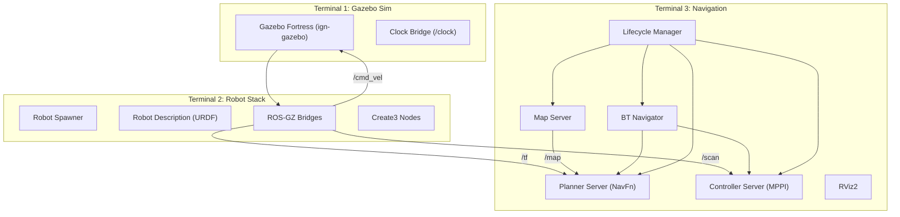

# Lyra Robot — Complete Running Guide

## System Overview

Lyra Robot is a ROS 2 Humble workspace that simulates an indoor home-assistant robot based on the **iRobot Create 3** platform. It combines:

- **Gazebo Fortress (Ignition Sim v6)** — 3D physics simulation
- **Create 3 robot simulation** — differential-drive robot with lidar, IMU, bumpers, cliff sensors
- **Nav2** — autonomous navigation (MPPI controller, NavFn planner)
- **SLAM** — Cartographer + slam_toolbox
- A **custom home environment** with furniture (sofas, beds, tables, toilets, kitchen, etc.)

---

## Prerequisites Check

| Component | Required | Your System |
|-----------|----------|-------------|
| ROS 2 Humble | ✅ | ✅ Installed at `/opt/ros/humble` |
| Gazebo Fortress (ign-gazebo v6) | ✅ | ✅ v6.16.0 |
| Nav2 | ✅ | ✅ All packages installed |
| Cartographer | ✅ | ✅ Installed |
| RMF building map tools | ✅ | ✅ Installed |
| OpenNav Docking | ✅ | ✅ Installed |
| iRobot Create 3 msgs | ✅ | ✅ Installed |
| Workspace built | ✅ | ✅ Packages in `install/` |

> [!TIP]
> All system dependencies are already installed. No additional `apt install` needed.

---

## Critical Setup: Source the Environment

> [!IMPORTANT]
> This is the **#1 reason** the commands fail. Every new terminal must source **both** the ROS 2 base install and the workspace overlay.

Run this in **every terminal** before any `ros2` command:

```bash
source /opt/ros/humble/setup.bash
source /home/proxi/projects/lyra_robot/install/setup.bash
```

Without this, `ros2` won't be in your PATH and none of the workspace packages will be found.

### Make it permanent (optional)

Add these lines to your `~/.bashrc`:

```bash
echo 'source /opt/ros/humble/setup.bash' >> ~/.bashrc
echo 'source /home/proxi/projects/lyra_robot/install/setup.bash' >> ~/.bashrc
```

---

## Step-by-Step Launch Process

You need **3 separate terminals**. Each one must be sourced as described above.

### Terminal 1: Launch the Home Simulation (Gazebo)

```bash
source /opt/ros/humble/setup.bash
source /home/proxi/projects/lyra_robot/install/setup.bash

ros2 launch lyra_home_gz _home.launch.xml headless:=false
```

**What this does:**
- Starts Gazebo Fortress with the custom home world
- Loads the apartment environment with furniture models
- Starts a ROS-GZ clock bridge (`/clock`)
- Opens the Gazebo GUI (if `headless:=false`)

**Expected output:**
```
[ign gazebo-1] [Msg] Ignition Gazebo Server v6.16.0
[ign gazebo-1] [Msg] Loading SDF world file[.../maps/home/home.world].
[ign gazebo-1] [Msg] World [home] initialized with [default_physics] physics profile.
```

> [!NOTE]
> **First launch takes longer** because Gazebo downloads model meshes (Sofa, Bed, Table, etc.) from [Fuel](https://app.gazebosim.org). These are cached in `~/.gazebo/models/` for subsequent runs.

**If running headless** (e.g., SSH without display):
```bash
ros2 launch lyra_home_gz _home.launch.xml headless:=true
```

**Wait** until you see `World [home] initialized` before proceeding.

---

### Terminal 2: Spawn the Create 3 Robot

```bash
source /opt/ros/humble/setup.bash
source /home/proxi/projects/lyra_robot/install/setup.bash

ros2 launch irobot_create_gz_bringup create3_gz.launch.py use_rviz:=false
```

**What this does:**
- Spawns the Create 3 robot into the already-running Gazebo world
- Spawns the standard dock model
- Starts the robot description (URDF) publishers
- Sets up ROS-GZ bridges for:
  - `/cmd_vel` (velocity commands)
  - `/scan` (lidar data)
  - `/tf` (transforms: odom → base_link)
  - Pose, bumper, cliff, IR intensity sensors
- Starts Create 3 toolbox nodes (pose republisher, sensors, buttons)
- Starts Create 3 application nodes (motion control, hazards, etc.)

**Expected output:**
```
[INFO] [create-1]: process started...
[INFO] [create-2]: process started...
...multiple bridge and node processes...
```

**The robot spawns at position `(10.3, -2.37, 0.0)`** inside the apartment.

> [!NOTE]
> Set `use_rviz:=true` if you want RViz to open with the Create 3 default config. But we'll launch a separate Nav2 RViz in Terminal 3.

---

### Terminal 3: Launch Navigation (Nav2)

```bash
source /opt/ros/humble/setup.bash
source /home/proxi/projects/lyra_robot/install/setup.bash

ros2 launch lyra_navigation navigation.launch.py
```

**What this does:**
- Starts the full Nav2 stack:
  - `controller_server` (MPPI controller)
  - `planner_server` (NavFn)
  - `smoother_server`
  - `behavior_server` (spin, backup, wait, drive_on_heading)
  - `bt_navigator` (behavior tree navigator)
  - `waypoint_follower`
  - `velocity_smoother`
  - `collision_monitor`
  - `map_server` (loads the saved occupancy map)
  - `map_saver`
  - `docking_server`
  - `lifecycle_manager` (manages all the above)
- Starts RViz2 with the Nav2 configuration
- Loads the pre-built map from `lyra_slam/maps/map_1738526783.yaml`

**Expected output:**
```
[lifecycle_manager]: Configuring controller_server
[lifecycle_manager]: Configuring planner_server
...
[lifecycle_manager]: Managed nodes are active
```

---

## Sending Navigation Goals

Once all 3 terminals are running and Nav2 is active:

### Option A: RViz GUI
1. In the RViz window that opens with Nav2
2. First, set the robot's initial pose:
   - Click **"2D Pose Estimate"** button in the toolbar
   - Click on the map where the robot actually is (approx `x=10.3, y=-2.37`)
   - Drag to set orientation
3. Then send a navigation goal:
   - Click **"2D Goal Pose"** button
   - Click on the map where you want the robot to go
   - The robot will plan and navigate autonomously

### Option B: Command line
```bash
# Set initial pose (localization)
ros2 topic pub /initialpose geometry_msgs/msg/PoseWithCovarianceStamped \
  "{header: {frame_id: 'map'}, pose: {pose: {position: {x: 10.3, y: -2.37, z: 0.0}, orientation: {w: 1.0}}}}" --once

# Send a navigation goal
ros2 action send_goal /navigate_to_pose nav2_msgs/action/NavigateToPose \
  "{pose: {header: {frame_id: 'map'}, pose: {position: {x: 7.0, y: -5.0, z: 0.0}, orientation: {w: 1.0}}}}"
```

---

## Architecture Diagram



---

## Topic Flow

| Topic | Type | Direction | Purpose |
|-------|------|-----------|---------|
| `/clock` | `rosgraph_msgs/Clock` | GZ → ROS | Simulation time |
| `/scan` | `sensor_msgs/LaserScan` | GZ → ROS | Lidar data |
| `/tf` | `tf2_msgs/TFMessage` | GZ → ROS | odom→base_link transform |
| `/cmd_vel` | `geometry_msgs/TwistStamped` | ROS → GZ | Velocity commands |
| `/map` | `nav_msgs/OccupancyGrid` | Map Server → Nav2 | Static map |
| `/odom` | `nav_msgs/Odometry` | Create3 → Nav2 | Odometry |

---

## Troubleshooting

### Problem: `ros2: command not found`

**Cause:** ROS 2 environment not sourced.
**Fix:**
```bash
source /opt/ros/humble/setup.bash
source /home/proxi/projects/lyra_robot/install/setup.bash
```

### Problem: `Package 'lyra_home_gz' not found`

**Cause:** Workspace overlay not sourced.
**Fix:** Source the install setup as above. If that doesn't work, rebuild:
```bash
cd /home/proxi/projects/lyra_robot
colcon build --symlink-install
source install/setup.bash
```

### Problem: Gazebo window doesn't open

**Cause:** No display available or GPU driver issue.
**Fix:** 
- Check `echo $DISPLAY` (should be `:0` or `:1`)
- Try: `export DISPLAY=:0` before launching
- For headless testing: use `headless:=true`

### Problem: Robot doesn't appear in Gazebo

**Cause:** Terminal 2 launched before Gazebo was ready.
**Fix:** Wait for `World [home] initialized` in Terminal 1 before launching Terminal 2.

### Problem: Nav2 nodes timeout waiting for transforms

**Cause:** Terminal 2 robot stack not running or not publishing TF.
**Fix:** 
- Verify robot is spawned: `ros2 topic list | grep tf`
- Check TF tree: `ros2 run tf2_tools view_frames`

### Problem: Models missing in Gazebo (empty room)

**Cause:** Gazebo models not downloaded yet.
**Fix:** Models download automatically on first run. Check `~/.gazebo/models/` for cached models. Ensure internet connectivity.

### Problem: Navigation doesn't work / robot doesn't move

**Cause:** The `map→odom` transform may not be published (AMCL is not in the current nav stack).
**Fix:** The bridge file includes a static `map→odom` transform (line 101-108 in `create3_ros_gz_bridge.launch.py`) but it's commented out in the default config (`# ld.add_action(map_odom_tf)`). For basic testing, you can either:
1. Enable the static transform by editing the bridge launch file, OR
2. Run AMCL alongside navigation:
```bash
ros2 launch lyra_slam carto_slam.launch.py
```

### Problem: Build fails for `lyra_home_gz`

**Cause:** The build uses RMF tools to generate the world from `home.building.yaml`. This requires internet for model download.
**Fix:**
```bash
cd /home/proxi/projects/lyra_robot
colcon build --symlink-install --packages-select lyra_home_gz
```

---

## Running SLAM Instead of Navigation

If you want to create a new map instead of using the saved one:

```bash
# Terminal 1: Gazebo (same as above)
ros2 launch lyra_home_gz _home.launch.xml headless:=false

# Terminal 2: Robot (same as above)
ros2 launch irobot_create_gz_bringup create3_gz.launch.py use_rviz:=false

# Terminal 3: Cartographer SLAM (instead of navigation)
ros2 launch lyra_slam carto_slam.launch.py

# Terminal 4: Teleoperate the robot to build the map
ros2 run teleop_twist_keyboard teleop_twist_keyboard --ros-args --remap cmd_vel:=/cmd_vel
```

---

## Quick Reference: Full Launch Sequence

```bash
# === TERMINAL 1 ===
source /opt/ros/humble/setup.bash
source /home/proxi/projects/lyra_robot/install/setup.bash
ros2 launch lyra_home_gz _home.launch.xml headless:=false
# Wait for "World [home] initialized"

# === TERMINAL 2 ===
source /opt/ros/humble/setup.bash
source /home/proxi/projects/lyra_robot/install/setup.bash
ros2 launch irobot_create_gz_bringup create3_gz.launch.py use_rviz:=false
# Wait for robot to spawn (see it in Gazebo)

# === TERMINAL 3 ===
source /opt/ros/humble/setup.bash
source /home/proxi/projects/lyra_robot/install/setup.bash
ros2 launch lyra_navigation navigation.launch.py
# Wait for "Managed nodes are active"

# Then use RViz to set initial pose and send goals
```

---

## Key File Locations

| File | Purpose |
|------|---------|
| [_home.launch.xml](file:///home/proxi/projects/lyra_robot/lyra_home_gz/launch/_home.launch.xml) | Main Gazebo launch file |
| [simulation.launch.xml](file:///home/proxi/projects/lyra_robot/lyra_home_gz/launch/simulation.launch.xml) | Gazebo sim configuration |
| [create3_gz.launch.py](file:///home/proxi/projects/lyra_robot/create3_sim/irobot_create_gz/irobot_create_gz_bringup/launch/create3_gz.launch.py) | Robot bringup |
| [create3_spawn.launch.py](file:///home/proxi/projects/lyra_robot/create3_sim/irobot_create_gz/irobot_create_gz_bringup/launch/create3_spawn.launch.py) | Robot spawn + bridges |
| [navigation.launch.py](file:///home/proxi/projects/lyra_robot/lyra_navigation/launch/navigation.launch.py) | Nav2 stack launch |
| [nav2_params.yaml](file:///home/proxi/projects/lyra_robot/lyra_navigation/params/nav2_params.yaml) | Navigation parameters |
| [home.world](file:///home/proxi/projects/lyra_robot/install/lyra_home_gz/share/lyra_home_gz/maps/home/home.world) | Generated Gazebo world |
| [map_1738526783.yaml](file:///home/proxi/projects/lyra_robot/lyra_slam/maps/map_1738526783.yaml) | Saved occupancy map |
| [gui.config](file:///home/proxi/projects/lyra_robot/lyra_home_gz/config/gui.config) | Gazebo GUI layout |
